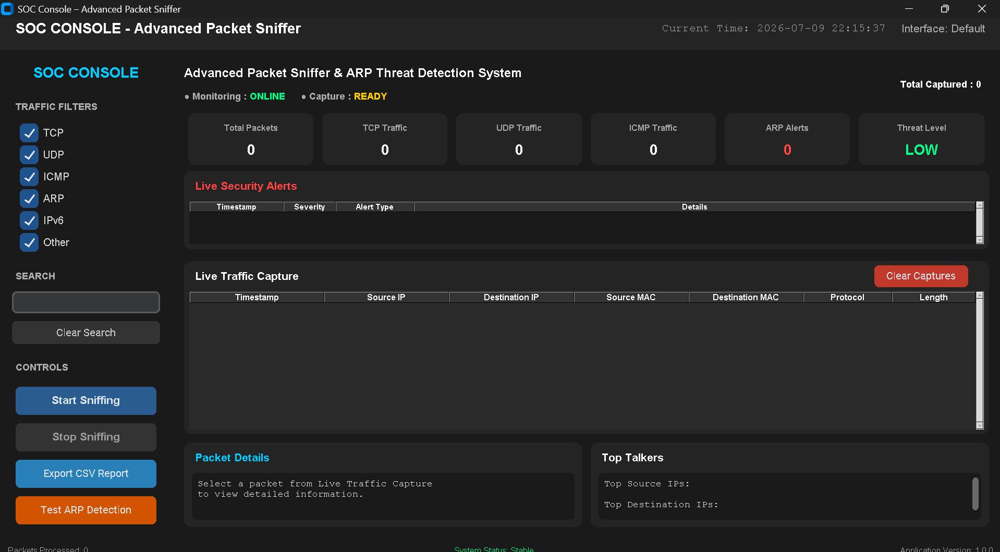
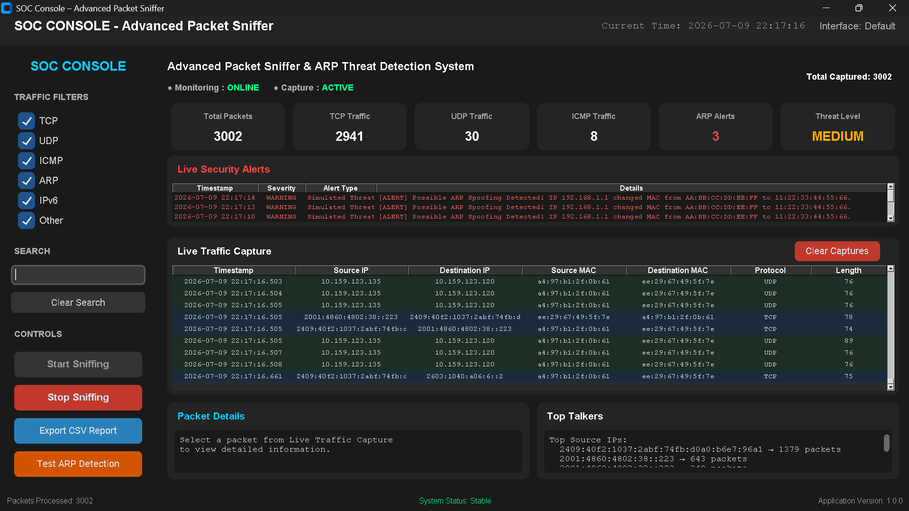
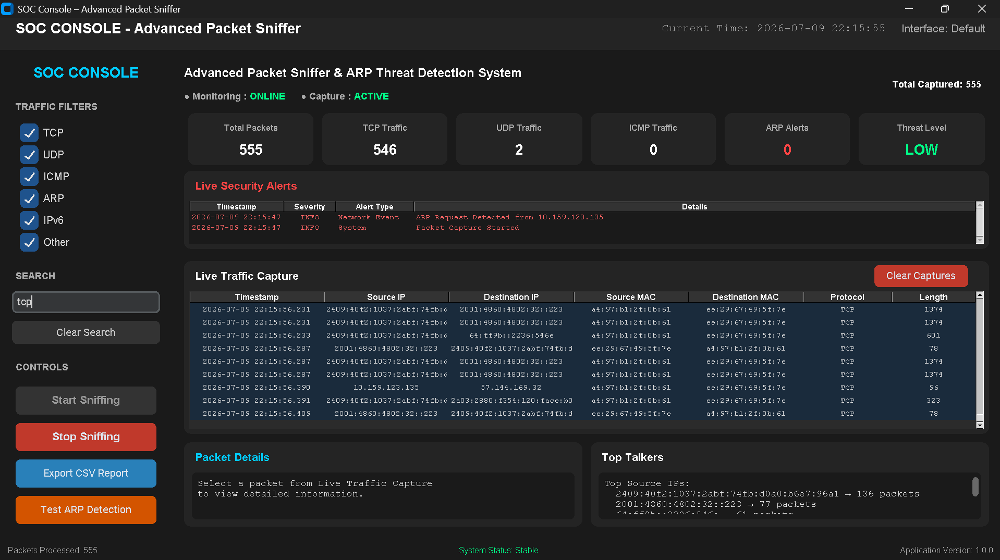
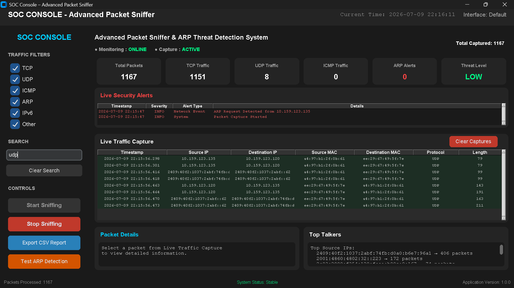
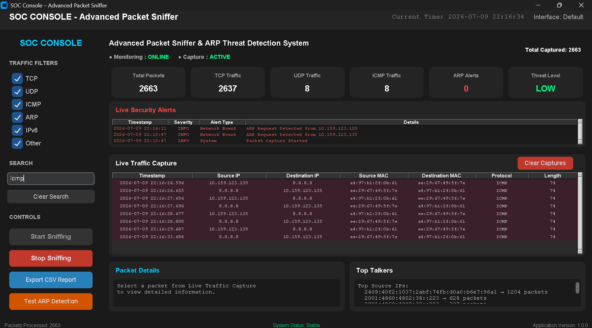
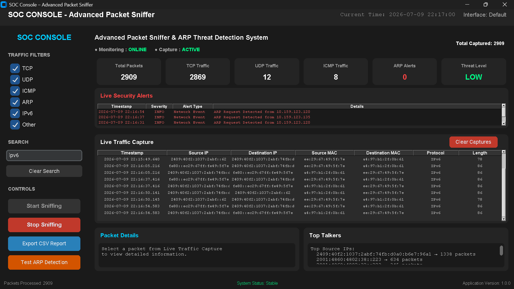
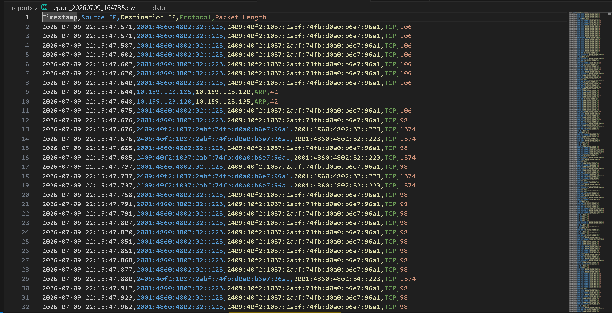
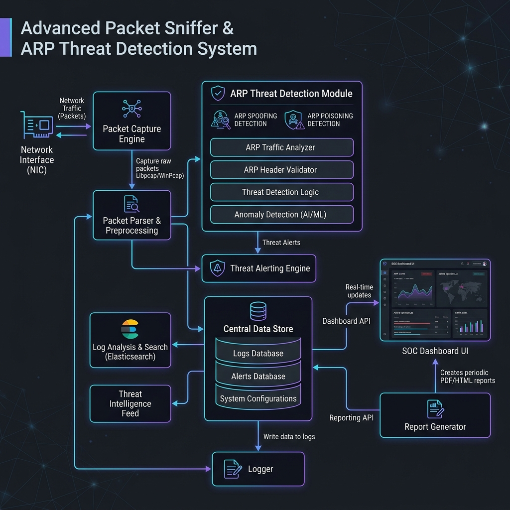

<h1 align="center">
🛡️ Advanced Packet Sniffer & ARP Threat Detection System
</h1>

<p align="center">
A Professional Python-based Network Security Monitoring Platform featuring
Real-Time Packet Capture, Protocol Analysis, ARP Spoofing Detection,
and an Interactive Security Operations Center (SOC) Dashboard.
</p>

<p align="center">


</p>

---

# 🛠️ Technologies Used

- Python
- Scapy
- CustomTkinter
- Threading
- Socket Programming
- CSV Processing
- Network Packet Analysis
- Network Protocols (TCP, UDP, ICMP, IPv4, IPv6, ARP)
- Real-Time Traffic Monitoring
- Cybersecurity & Network Defense

---

# 🎯 Skills Demonstrated

- Network Traffic Analysis
- Deep Packet Inspection (DPI)
- ARP Spoofing Detection
- Threat Detection & Monitoring
- Security Operations Center (SOC) Concepts
- Python Application Development
- GUI Development using CustomTkinter
- Multi-threaded Programming
- Logging & Report Generation
- Network Security Fundamentals
- Incident Detection & Response
- Secure Software Development

---

# ✨ Features

- 📡 Real-Time Network Packet Capture
- 🌐 Supports IPv4, IPv6, TCP, UDP, ICMP, and ARP
- 🛡️ Real-Time ARP Spoofing Detection
- 📊 Interactive SOC Dashboard
- 🚨 Dynamic Threat Level Indicator
- 🔍 Live Packet Search & Filtering
- 📈 Top Source & Destination IP Analysis
- 📁 CSV Report Export
- 📝 Alert Logging
- ⚡ Multi-threaded Packet Processing
- 💻 GUI & CLI Support

---

# 🏗️ Architecture

| Module | Description |
|---------|-------------|
| `main.py` | Application Entry Point |
| `packet_sniffer.py` | Packet Capture Engine using Scapy |
| `packet_analyzer.py` | Deep Packet Inspection |
| `arp_detector.py` | ARP Spoofing Detection |
| `logger_manager.py` | Logging & Alert Management |
| `report_generator.py` | CSV Report Generation |
| `gui/dashboard.py` | SOC Dashboard GUI |

---

# 📸 Dashboard Screenshots

## Dashboard



---

## ARP Detection



---

## TCP Packet Capture



---

## UDP Packet Capture



---

## ICMP Packet Capture



---

## IPv6 Packet Capture



---

## Report Export



---

## System Architecture



---

# ⚙️ Installation

## Clone Repository

```bash
git clone https://github.com/likhith-h-l/Advanced_Packet_Sniffer_ARP_Detector.git
cd Advanced_Packet_Sniffer_ARP_Detector
```

## Create Virtual Environment

### Windows

```bash
python -m venv venv
venv\Scripts\activate
```

### Linux / macOS

```bash
python3 -m venv venv
source venv/bin/activate
```

## Install Dependencies

```bash
pip install -r requirements.txt
```

## Run the Application

```bash
python main.py
```

---

# 📋 Requirements

- Python 3.8+
- Scapy
- CustomTkinter

### Windows

- Npcap

### Linux

- libpcap

> Administrator/root privileges are required for packet sniffing.

---

# 🔄 How It Works

## Packet Capture Workflow

```text
Start Capture
      │
      ▼
Packet Sniffer (Scapy)
      │
      ▼
Packet Analyzer
      │
      ▼
GUI Dashboard
      │
      ▼
Logger
      │
      ▼
CSV Reports
```

---

## ARP Detection Workflow

```text
Capture ARP Packet
        │
        ▼
Check IP → MAC Mapping
        │
        ▼
Known Mapping?
   │            │
  Yes          No
   │            │
MAC Changed?    Store Mapping
   │
 ┌─┴─────────────┐
 │               │
No             Yes
 │               │
Log INFO    Raise Warning
                │
                ▼
Update Threat Level
                │
                ▼
SOC Dashboard Alert
```

---

# 📂 Project Structure

```text
Advanced_Packet_Sniffer_ARP_Detector/
│
├── assets/
│   ├── dashboard.png
│   ├── arp_detection.png
│   ├── tcp_capture.png
│   ├── udp_capture.png
│   ├── icmp_capture.png
│   ├── ipv6_capture.png
│   ├── report_export.png
│   └── architecture.png
│
├── gui/
│   ├── __init__.py
│   └── dashboard.py
│
├── logs/
│   └── .gitkeep
│
├── reports/
│   └── .gitkeep
│
├── test_data/
│
├── arp_detector.py
├── logger_manager.py
├── main.py
├── packet_analyzer.py
├── packet_sniffer.py
├── report_generator.py
├── test_parsing.py
│
├── requirements.txt
├── README.md
├── LICENSE
├── .gitignore
└── .gitattributes
```

---

# 🚀 Future Improvements

- SIEM Integration (Splunk, ELK, Microsoft Sentinel)
- HTTP / HTTPS / DNS Inspection
- PCAP File Import & Analysis
- Machine Learning-based Threat Detection
- Email Alert Notifications
- Geo-IP Mapping
- Threat Intelligence Integration
- Dashboard Analytics & Charts
- Dark / Light Theme Support

---

# 👨‍💻 Author

**Likhith H L**

Cybersecurity Student | AI-Integrated SOC Analyst | Cloud Security Enthusiast

🔗 GitHub: https://github.com/likhith-h-l

---

# 📜 License

This project is licensed under the **MIT License**.

---

# ⚠️ Disclaimer

This project is intended **only for educational purposes and authorized security testing**.

Always obtain proper authorization before capturing or monitoring network traffic.

Unauthorized packet sniffing may violate organizational policies or applicable laws.
